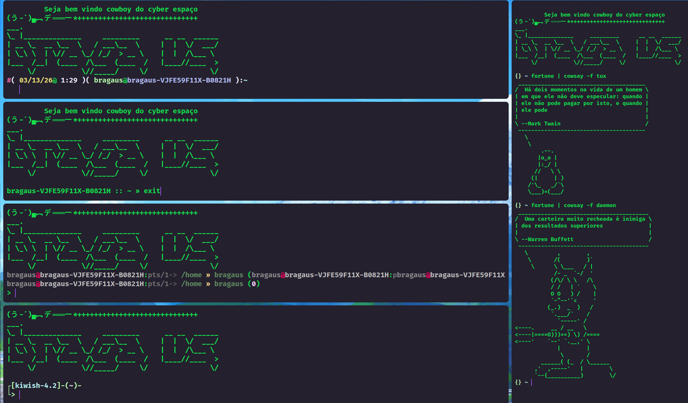
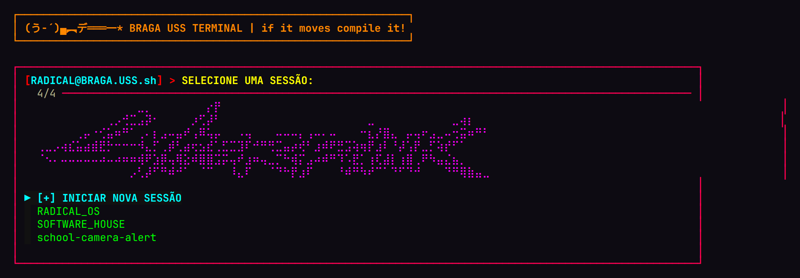
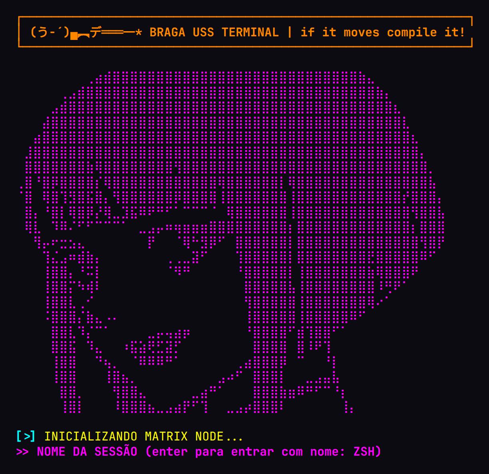
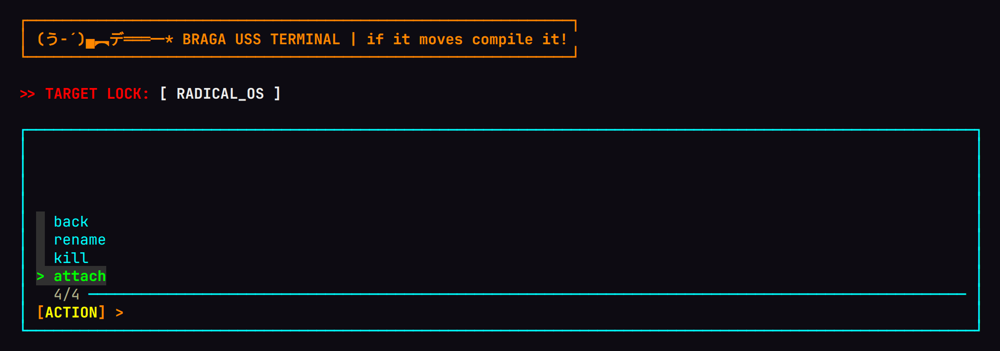
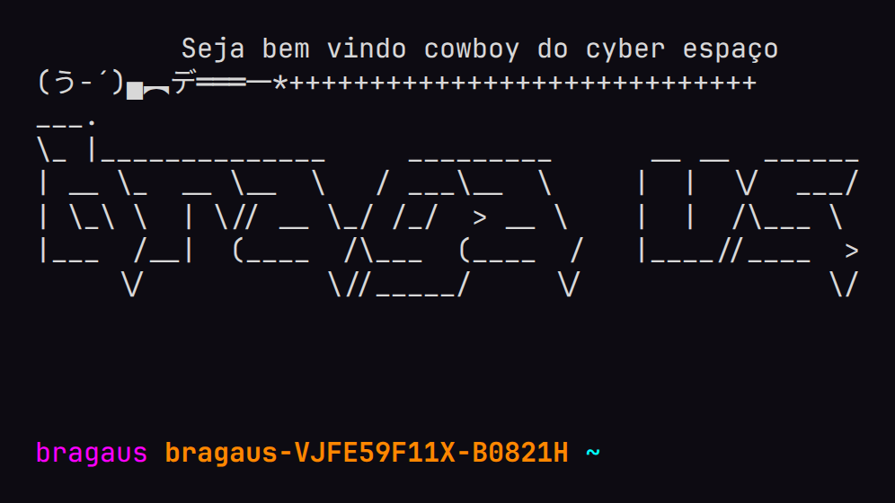
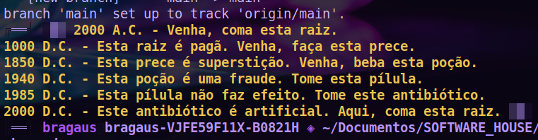

# TRACTADO DE CONFIGURAÇÃO DO INTERPRETADOR Z-SHELL

> Apresentado á douta congregação dos terminaes no anno da graça de
> MDCCCXCVIII, este modesto compendio, no qual o auctor — doutor em
> sciencias mathematicas — se propõe a ordenar, segundo o rigoroso
> methodo euclidiano, as definições, axiomata, funcções e abreviaturas
> (vulgo "aliases") que governam a sua machina de calcular.
>
> — *Prof. Dr. BRAGA USS, Cathedratico*


*GRAVURA PANORAMICA — a machina em pleno funccionamento: quatro
quadrantes, duas philosophias de cowsay e um pinguim ceremonial.*

**ADVERTENCIA AO LEITOR:** a ordem das proposições não é arbitraria.
Tal como num tractado de geometria, cada lemma depende dos que o
precedem; que ninguem ouse permutar as secções do `.zshrc` sem antes
demonstrar a independencia das suas variaveis.

---

## INDICE DAS SECÇÕES

|   §   | Materia                                                        |
| :---: | -------------------------------------------------------------- |
|   I   | Do objecto do presente tractado                                 |
|  II   | Das estampas — gravuras colhidas do natural                     |
|  III  | Dos requisitos — instrumentos de que carece a machina           |
|  IV   | Da installação — modo de encadernar o manuscripto               |
|   V   | Das funcções — theoremas e demonstrações                        |
|  VI   | Das abreviaturas — taboa de symbolos                            |
|  VII  | Epilogo                                                         |

---

## § I. DO OBJECTO DO PRESENTE TRACTADO

Guarda-se neste repositorio um unico manuscripto: o ficheiro `.zshrc`
que governa o terminal do auctor. Não é, porém, um `.zshrc` qualquer;
é um **tractado completo**, dividido em sete secções commentadas á
maneira dos compendios oitocentistas de mathematica — definições,
axiomata, postulados, theoremas, lemmas, escholios e corollarios —
de sorte que o leitor apprende não sómente *o que* cada linha faz,
mas *por que* alli se acha e *o que ruiria* se d'alli fosse movida.

Entre as suas maravilhas contam-se:

- **Gerenciador de sessões tmux** interactivo (Theorema II, *magnum opus*),
  com menus em `fzf` tingidos de neon e gravuras em caracteres Braille;
- **Disparo automatico do tmux** ao abrir o terminal (§ IV do manuscripto);
- **Navegação errante** com `yazi` + `zoxide` (Theorema I);
- **Actualização universal** de repositorios com `allgit` (Theorema III);
- **Cerebro magno** (`megabrain`, Theorema IV), que convoca o automato
  Claude para resolver as tarefas do Linear;
- **Taboa de abreviaturas** á maneira das taboas de logarithmos.

---

## § II. DAS ESTAMPAS — GRAVURAS COLHIDAS DO NATURAL

Seguem-se as estampas, gravadas directamente do apparelho do auctor,
sem retoque que lhes roubasse a fidelidade.

### ESTAMPA I — Do menu das sessões

Achando-se o observador fóra de qualquer sessão tmux, apresenta-se-lhe
o menu principal: o frontispicio do BRAGA USS TERMINAL, a gravura menor
em caracteres Braille, e a enumeração das sessões existentes, tudo
regido pelo instrumento `fzf` (Lemma II.6).



### ESTAMPA II — Da creação de nova sessão, com a gravura maior

Eleita a opção `[+] INICIAR NOVA SESSÃO`, exhibe-se a gravura maior —
LUCY ꨄ♡, documento de epocha que nenhum copista ousaria emendar — e
interroga-se o observador pelo nome do novo nodo, com prova de
unicidade: repete-se a pergunta emquanto houver collisão (Lemma II.5).



### ESTAMPA III — Do menu de acções sobre sessão eleita

Eleita uma sessão, trava-se o alvo (*TARGET LOCK*) e offerecem-se ao
observador as quatro operações fundamentaes: `attach`, `kill`,
`rename` e `back` (Lemma II.7).



### ESTAMPA IV — Da saudação ao viajante

Concluidas as demonstrações do manuscripto, saude-se o cowboy do
cyber espaço com a devida pompa typographica (§ VII do tractado).



### ESTAMPA V — Do prompt em seu habitat natural

Gravura de epocha, colhida do proprio apparelho do auctor: o thema
`adben` a philosophar sobre raizes, preces, poções, pilulas e
antibioticos, como convem a todo terminal que se preze.



---

## § III. DOS REQUISITOS — INSTRUMENTOS DE QUE CARECE A MACHINA

Postula-se a existencia previa dos seguintes engenhos:

| Instrumento                                     | Officio                                    | Obrigatoriedade                                |
| ----------------------------------------------- | ------------------------------------------ | ---------------------------------------------- |
| [zsh](https://www.zsh.org/)                     | o proprio interpretador                    | absoluta                                        |
| [Oh My Zsh](https://ohmyz.sh/)                  | bibliotheca fundamental (§ II do tractado) | absoluta                                        |
| [tmux](https://github.com/tmux/tmux)            | multiplexador de sessões (Theorema II)     | absoluta                                        |
| [zoxide](https://github.com/ajeetdsouza/zoxide) | engenho que apprende os directorios        | absoluta (Definição 2)                          |
| [fzf](https://github.com/junegunn/fzf)          | menus interactivos                         | dispensavel — na falta, usa-se o menu numerico  |
| [yazi](https://github.com/sxyazi/yazi)          | navegador de ficheiros (Theorema I)        | dispensavel — só carece d'elle a funcção `y`    |

Requerem-se ainda os plugins `zsh-navigation-tools` e `vim-interaction`
do Oh My Zsh, e recommenda-se fonte com caracteres Braille (uma
*Nerd Font*, v.g. JetBrainsMono), sem a qual as gravuras degeneram
em quadradinhos — vicio que nenhuma mathematica corrige.

---

## § IV. DA INSTALLAÇÃO — MODO DE ENCADERNAR O MANUSCRIPTO

**Proposição IV.1.** Clone-se o repositorio:

```sh
git clone https://github.com/bragaus/RADICAL-ZSH.git
```

**Proposição IV.2.** Preserve-se o manuscripto anterior, pois só o
imprudente queima a edição velha antes de conferir a nova:

```sh
cp ~/.zshrc ~/.zshrc.bak
```

**Proposição IV.3.** Ligue-se o tractado ao seu posto por elo symbolico
(preferivel, pois `git pull` passa a actualizar a machina em vivo):

```sh
ln -sf "$PWD/RADICAL-ZSH/.zshrc" ~/.zshrc
```

**Corollario.** Abra-se novo terminal. O tmux dispara automaticamente
(§ IV do tractado); quem desejar prohibil-o momentaneamente, declare a
grandeza `NO_TMUX`:

```sh
NO_TMUX=1 zsh
```

**Escholio.** Os caminhos do § V do manuscripto (Android SDK, Flutter,
npm) e a taboa do § VI referem-se aos directorios do auctor; cada
leitor os emende segundo a sua propria machina — eis a unica emenda
que se consente.

---

## § V. DAS FUNCÇÕES — THEOREMAS E DEMONSTRAÇÕES

| Theorema | Funcção     | Enunciado                                                                                                                                                        |
| :------: | ----------- | ---------------------------------------------------------------------------------------------------------------------------------------------------------------- |
|    I     | `y`         | Invoca o yazi e, findo o passeio, transporta o observador ao ultimo directorio visitado. C.Q.D.                                                                    |
|    II    | `tmux`      | *Magnum opus.* Sobrescreve o commando nativo com menu interactivo para crear, annexar, exterminar e rebaptizar sessões. Dentro de sessão, delega ao tmux verdadeiro. |
|   III    | `allgit`    | Percorre o repositorio-raiz e cada sub-repositorio, determina o ramo principal do remoto e o puxa para si.                                                         |
|    IV    | `megabrain` | Transporta o auctor á SOFTWARE_HOUSE e alli convoca o automato Claude — modelo opus, esforço maximo — para as tarefas do Linear.                                   |
| Lemma V  | `hk`        | Movimento perpetuo: executa `gentoo.py`, exhibe a espingarda ceremonial, repousa dois segundos e recomeça.                                                         |

---

## § VI. DAS ABREVIATURAS — TABOA DE SYMBOLOS

Consigna-se no § VI do manuscripto a taboa completa, á maneira das
taboas de logarithmos: symbolos breves para operações longas — `z`
para emendar o proprio tractado, `t` para o tmux, `c` para o automato
Claude, `atualizar` para os submodulos, e outras que o leitor
descobrirá com proveito e espanto.

*Escholio 1:* a abreviatura `z` acha-se definida DUAS vezes com
identico valor — redundancia innocua, como quem soma zero a uma
grandeza. *Escholio 2:* `vb` e `vt` invocam o mesmissimo commando;
conservam-se ambas por fidelidade ao manuscripto.

---

## § VII. EPILOGO

Ficam assim demonstradas todas as proposições que governam esta
machina. Se algum erro subsistir, attribua-se ao copista e jámais á
mathematica, que é infallivel.

Dado no gabinete do auctor, sob a luz do candieiro a gaz.

**Quod Erat Demonstrandum.**

```
(う-´)▄︻デ═══一*  if it moves, compile it!
```
